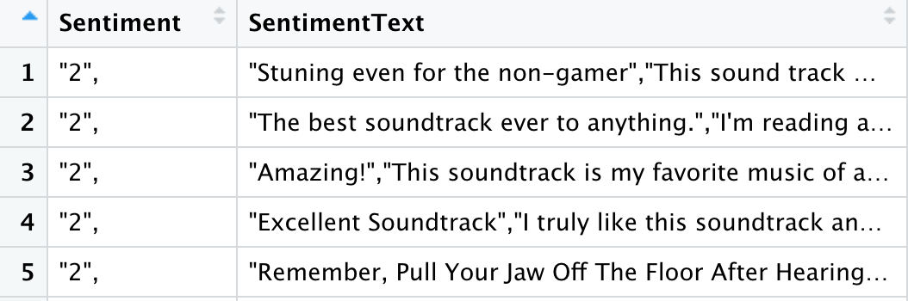
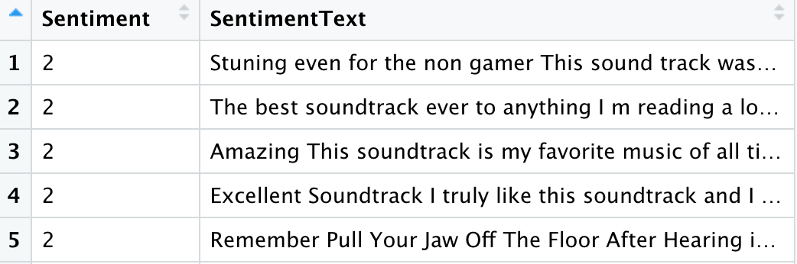
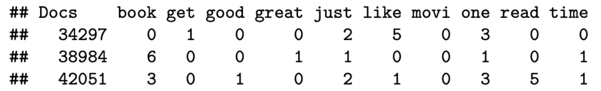

```{r setup, include=FALSE}
knitr::opts_chunk$set(echo = FALSE)
# tinytex::install_tinytex()
```


## Data Preprocessing
- Data before cleaning
{width=300 height=100}
- Data after cleaning
{width=300 height=100}

## Model 1: Bag of Words(BoW) with Naive Bayes

- BoW: widely used in NLP and computer vision fields. It takes the occurrence of each word in the text regardless of grammar and makes it into “bags” to characterize the text.

- Final results:

  - *Amazon Review* dataset: 81.19%
  
  - *Drug Review* dataset: 74.77%
{width=300 height=210}

{width=300 height=160}


## Model 2: Pretrained word2vec word embedding with random forest algorithm

- pretrained word embedding

- based on the Reuter_50_50 dataset
  
- calculated the review sentences embedding 
  
- Final results:

  - *Amazon Review* dataset: 62.56%
  
  - *Drug Review* dataset: 70.99%
  

## Model 3:  GloVe word embedding with random forest algorithm

- combines the global statistics of matrix factorization techniques

- constructs an explicit word context or word co-occurrence matrix 
  
- obtain word embeddings from our own training corpus

- Final results:

  - *Amazon Review* dataset: 72.72%
  
  - *Drug Review* dataset: 74.96%

## Model 4: FastText word Embedding

- fastText: created by the Facebook's AI Research lab in 2016

  - breaking words into n-grams (subwords), and generating word embeddings by taking the sum of those subwords

  - e.g. 2-grams for word *help* will be "he, el, lp"

- `fastTextR` package:

  - `ft_control`: set hyperparameter for fastText

  - `ft_train`: train the model

  - `ft_predict`: predict values based on the trained model
  
  - `ft_test`: evaluate the model

- Final results:

  - *Amazon Review* dataset: 86.48%
  
  - *Drug Review* dataset: 78.96%


## Conclusion & Discussion

- Results in glance:

                      Bow         word2vec      GloVe         FastText 
----------------- ----------- --------------- ----------    ------------
 Amazon Review      81.19%        62.88%        71.99%         86.48%
  Drug Review       74.77%        71.02%        74.83%         78.69%

- Possible improvements for `word2vec`:

  - create specific word embeddings for the dataset to minimize the effect of pre-trained embeddings
  
- Future directions:

  - try more classification models such as XGBoost and AdaBoost
  
  - split the dataset into train, validation, test subsets


# Thank you!


